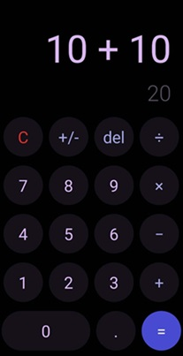

# Calculadora React Native 📱

¡Bienvenido a la calculadora React Native! Esta es una aplicación simple de calculadora construida utilizando React Native. Permite realizar operaciones matemáticas básicas como suma, resta, multiplicación y división.

## Funcionalidades 🔧

- **Operaciones básicas**: Realiza operaciones matemáticas básicas como suma, resta, multiplicación y división.
- **Borrar y limpiar**: Borra el último dígito ingresado o limpia por completo la pantalla de la calculadora.
- **Cambio de signo**: Cambia el signo del número mostrado en la pantalla.
- **Resultado instantáneo**: Muestra el resultado de la operación tan pronto como se presiona el botón de igual (=).

## Capturas de pantalla 📸

## Cómo usar 🚀

1. Clona este repositorio en tu máquina local.
2. Abre el proyecto en tu editor de código favorito.
3. Ejecuta `npm install` para instalar todas las dependencias.
4. Asegúrate de tener configurado el entorno de desarrollo para React Native. Puedes seguir la [documentación oficial](https://reactnative.dev/docs/environment-setup) para más detalles.
5. Ejecuta `npm run-android` para iniciar la aplicación en un dispositivo Android o `npm run-ios` para iniciar la aplicación en un dispositivo iOS.

## Contribuir 💡

¡Las contribuciones son bienvenidas! Si tienes alguna idea para mejorar esta calculadora, por favor abre un issue o envía una pull request.

## Tecnologías utilizadas 🛠️

- React Native
- TypeScript

Creado con ❤️ por [Bryan](https://github.com/BryanQuin3)
